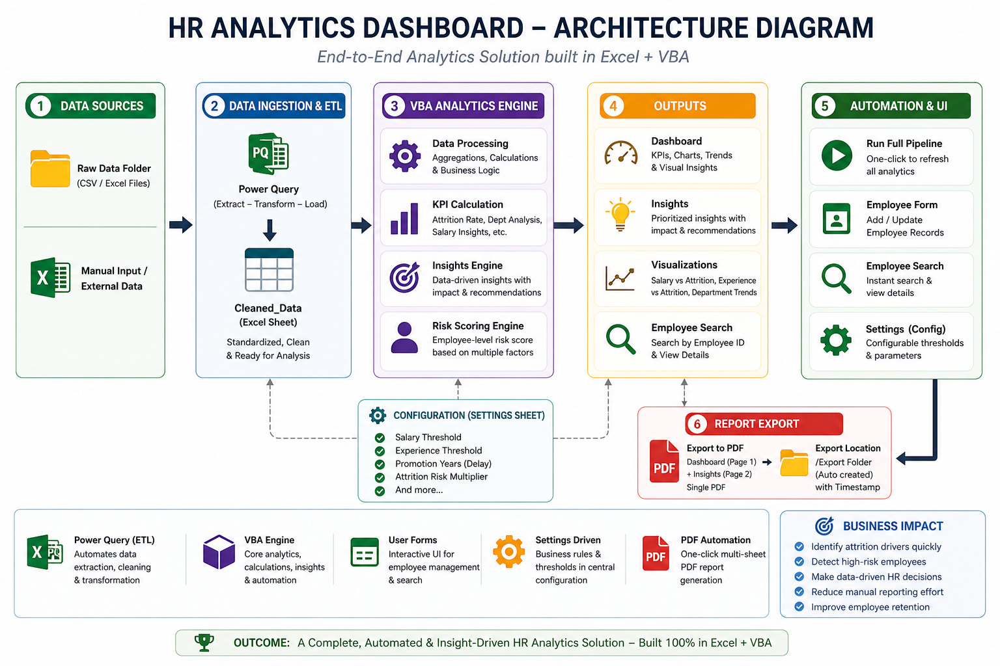
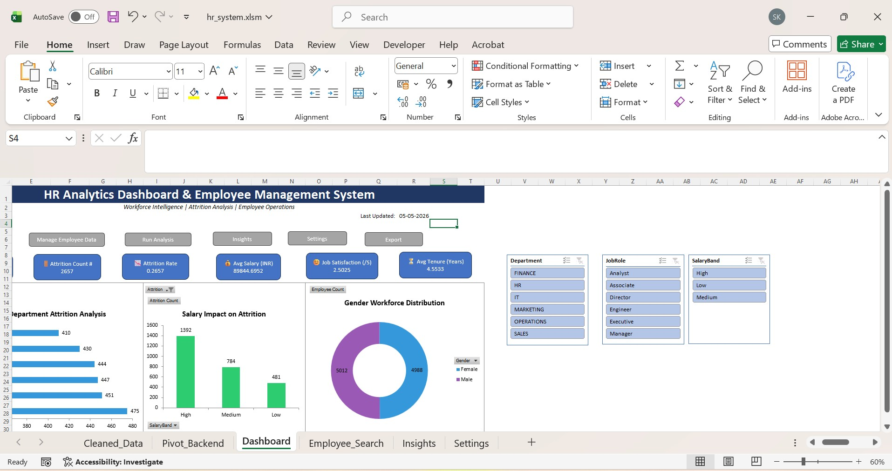
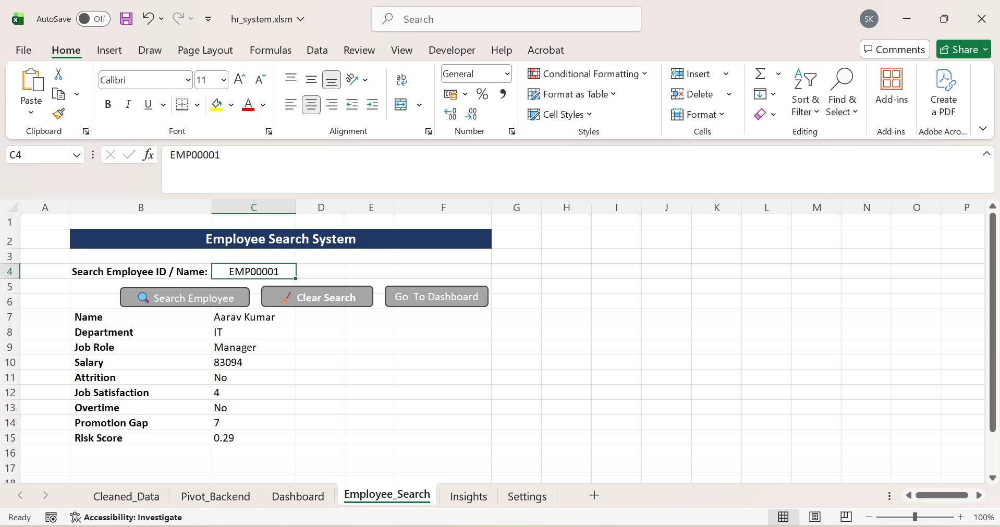
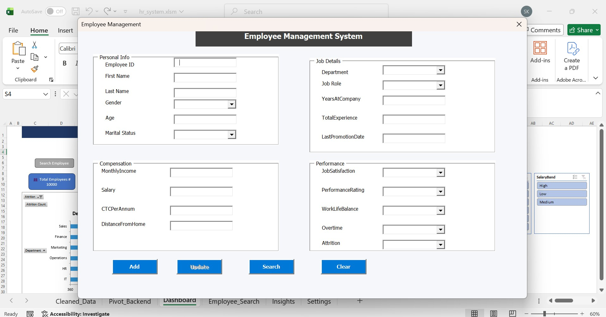

# 🚀 HR Analytics Dashboard & Employee Management System (Excel + VBA)

## 🧠 Problem Statement

HR teams often struggle to identify **why employees leave** and **who is at risk**, especially when data is scattered and insights are manual.

This project solves that by building a **complete, automated HR analytics system** inside Excel that:
- Analyzes employee attrition
- Identifies high-risk segments
- Generates **data-driven recommendations**
- Produces **ready-to-share PDF reports**

---

## ⚙️ Solution Overview

This is an **end-to-end analytics pipeline** built using Excel, VBA, and Power Query.

### 🔄 Data Flow 
Raw Data (CSV / Folder) -> Power Query (ETL) -> Cleaned Data -> VBA Analytics Engine -> Dashboard + Insights -> PDF Export

---

### 🔄 Architecture

---

## 🔥 Key Features

### 📊 Analytics Dashboard
- Total Employees, Attrition Count & Rate
- Department-wise Attrition Analysis
- Salary-based Attrition Insights
- Experience-based Risk Analysis

---

### 🔍 Employee Search System
- Instant lookup using Employee ID
- Displays:
  - Name
  - Department
  - Salary
  - Attrition Status
  - Risk Score

---

### 🧠 Data-Driven Insights Engine
Automatically generates insights such as:
- High-risk departments (compared to company average)
- Salary-driven attrition risk
- Early-career employee churn
- Promotion gap impact
- Overtime impact on attrition

Each insight includes:
- Priority (HIGH / MEDIUM / LOW)
- Business impact
- Actionable recommendation

---

### ⚠️ Risk Scoring Engine
Employee-level risk score based on:
- Overtime
- Job Satisfaction
- Salary threshold
- Promotion delay

---

### 🧾 Employee Management System (UserForm)
- Add new employees
- Search employees
- Update records
- Clean and interactive UI

---

### ⚡ Automation
- One-click pipeline execution
- Power Query data ingestion
- Auto dashboard refresh
- Multi-sheet PDF export (Dashboard + Insights)

---

### 📄 PDF Report Export
- Exports **Dashboard + Insights** into a single report
- Automatically saves to `/Export` folder
- Timestamp-based file naming

---

## ⚙️ Configuration (Settings Driven)

System behavior is controlled via **Settings sheet**:

| Parameter | Description |
|----------|------------|
| Salary_Threshold | Defines low salary group |
| Experience_Threshold | Defines early career |
| Promotion_Years | Years before promotion risk |
| Attrition_Risk_Multiplier | Threshold for high risk |

👉 No code change required — fully configurable

---

## ▶️ How to Run

1. Open the `.xlsm` file
2. Enable macros
3. Click **Run Analysis**
4. Explore:
   - Dashboard
   - Insights
5. Use:
   - Employee Search
   - Employee Form
6. Click **Export** for PDF report output

---

## 📸 Screenshots

### 📊 Dashboard

### 🔍 Employee Search

### 🧾 Employee Form

---

## 🛠️ Tech Stack

- **Excel (Advanced)**
- **VBA (Automation + UI + Logic)**
- **Power Query (ETL)**

---

## 🎯 Key Highlights

- Built a **complete analytics pipeline inside Excel**
- Implemented **data-driven insights engine**
- Designed **configurable system using Settings sheet**
- Developed **risk scoring model for employees**
- Created **interactive UI using VBA UserForms**
- Automated **multi-sheet PDF reporting**

---

## 🚀 Future Enhancements

- Drill-down dashboards
- Email automation for reports
- High-risk employee alerts
- Migration to Power BI

---

## 💼 Business Impact

This solution enables HR teams to:
- Identify **attrition drivers quickly**
- Take **proactive retention actions**
- Reduce manual reporting effort
- Make **data-driven HR decisions**

---

## 📌 Author

**Sanjay Kumawat**

---

## ⭐ If you found this useful

Give it a ⭐ on GitHub and feel free to fork or contribute!
